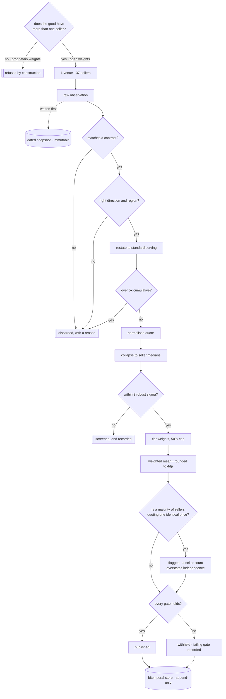
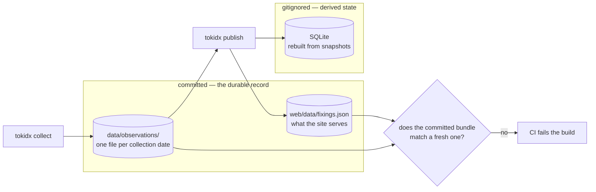

# Token Price Index

A reference implementation of a price benchmark for LLM inference, built around
a settlement benchmark's constraints rather than a pricing comparison
page's.

It exists to answer one question honestly: **which parts of the token market
can carry an index at all, and which cannot.**

## Scope, stated up front

It sits beside [gpu-price-index](https://github.com/henryzhangpku/gpu-price-index),
which asks the same question of compute rental.

**What is here.** Live daily collection from a public source that publishes, per
model, what each independent seller charges to serve the identical weights --
97 observations across 35 sellers on the first run. Collection and estimation
are separate processes: `tokidx collect` reaches the network once and writes a
dated snapshot, and everything downstream reads that file and reaches nowhere,
so a published value can always be shown to follow from its own inputs. A
bitemporal store, where corrections append and must carry a reason. Robust
estimation with a ratio fallback where the usual screen is undefined.
Publication gates that withhold rather than guess. Quality checks for
staleness, seller dropout and level shifts. A property suite over generated
markets rather than chosen ones.

**What is not, and it is the important one.** Every observation arrives through
**one venue**. Twenty-seven sellers of the same weights is twenty-seven sellers
and *one source*. If that source changed its schema, mis-parsed a field, or
went away, the seller count would not notice -- it would keep reporting
twenty-seven right up until it reported none. The compute benchmark found
exactly this shape in its own inputs, where twelve providers turned out to be
five venues with one aggregator behind eight of them, and both count gates
still passed when that feed was removed.

So collected observations sit at the aggregated tier rather than the list tier,
and the venue count is printed next to the seller count. A single-venue index
is not disqualified by that. It is disqualified by not saying so.

**And nothing is calibrated yet.** The compute benchmark sets its
contributor-shift threshold at 25% from 403 observed daily moves with p99 at
21.2%. The equivalent number here is judgement, and the checks that would use
it report `not_evaluable` rather than passing quietly, because a control that
reports success on no evidence is worse than no control. The series is one day
old.

```
daily fixing
+-----------------------------------------------------------------------------+
|index            | value | prov | obs |  disp | status    | why              |
|-----------------+-------+------+-----+-------+-----------+------------------|
|TIX-GLM53-OUT    | 0.331 |   27 |  27 | 0.000 | published |                  |
|TIX-GLM53-IN     | 0.099 |   27 |  27 | 0.000 | published |                  |
|TIX-K3-OUT       | 9.403 |   16 |  19 | 0.111 | published |                  |
|TIX-DSV41-OUT    | 0.701 |   12 |  12 | 0.171 | published |                  |
|TIX-MM3-OUT      | 0.923 |   12 |  12 | 0.000 | published |                  |
|TIX-FRONTIER-OUT |    -- |    0 |   0 |    -- | withheld  | indexable good,  |
|                 |       |      |     |       |           | min providers,   |
|                 |       |      |     |       |           | min observations,|
|                 |       |      |     |       |           | dispersion       |
+-----------------------------------------------------------------------------+
  USD per million tokens. 1 of 6 indices decline to print,
  and 1 of those cannot print by construction rather than for want of data.
```

## The finding

**A frontier model index is not a benchmark. It is one seller's list price
wearing an index's name.**

Only Anthropic sells Opus 5. Only OpenAI sells GPT-6 Astra. There is no second
price for the same good, so there is nothing to discover, no dispersion to
measure, and no meaningful sense in which an average of them is a market rate.
Publishing one would lend a private pricing decision the authority of a
benchmark.

**Open-weight models are the opposite.** The same weights are served by many
independent sellers competing on price, and the spread is real:

| Kimi K2.6, output | price per Mtok |
|---|---|
| DeepInfra | $3.50 |
| Fireworks | $4.00 |
| Together | $4.50 |

Identical weights, three sellers, a 29% spread. That is a market, and an index
over it measures something.

So `TIX-FRONTIER-OUT` is included **specifically to be refused.** The gate that
stops it is `indexable_good`, and it fails before any question of data
sufficiency arises.

## Quickstart

```bash
uv run tokidx publish                     # the board
uv run tokidx explain TIX-K26-OUT         # one fixing, end to end
uv run tokidx explain TIX-FRONTIER-OUT    # why a good can be unindexable
uv run tokidx contracts                   # goods, tiers, factors, gates
uv run tokidx calibrate                   # test the factors against sellers
```

`explain` is the one to look at. It walks a fixing in four stages — whether the
good is indexable, what was restated or discarded, which sellers survived the
screen and what weight they carry, and which gates held.

## How it is built

Every arrow that leaves the main line is a place an input is thrown away. Most
of the work in a benchmark is deciding what does not count -- and the first
decision here is made before any price is read.



The concentration branch is not decoration. On the first live collection, 15 of
27 sellers of the same weights quoted an identical price, which is why
dispersion is measured at the ninetieth percentile of deviation rather than the
median: with a majority at one number, MAD is zero on a market spanning six
times. See METHODOLOGY section 5.




**One good per index, and input is never mixed with output.** They are priced
differently by every seller and consumed in different ratios by different
workloads; blending them requires an assumed ratio nobody can observe.

**Rank inputs by what they prove.** A published API rate card is transactable
today by anyone with a card, so unlike a compute-rental benchmark the top
evidence tier is genuinely populated. A price seen through a router carries
less weight, because the router's margin is not visible.

**Collapse each seller to one median.** A provider serving forty models gets
one vote, not forty.

**Screen on median absolute deviation**, which has a 50% breakdown point,
rather than standard deviation, which has none — the outlier being screened for
inflates the very yardstick measuring it. With no spread at all, MAD is zero
and the sigma test is undefined, so the screen falls back to a symmetric ratio
band against the consensus.

**Gate publication** on whether the good is indexable, the seller count, the
observation count, and dispersion. Every gate must hold.

**And withholding is a first-class outcome.** Three of five indices decline to
print. A gap in a series is a fact about the market; an interpolated value is a
fiction about it.

## What this cannot do

The full list is in [METHODOLOGY.md](METHODOLOGY.md) section 6. The three that
matter most:

**No transaction data.** Every input is a published rate card. Nobody here
observes what anyone actually paid, and enterprise pricing — where the volume
is — is negotiated and invisible. This measures the retail tail.

**No quality adjustment.** Price per token falls while model capability rises,
and this index treats a token as a token. That is the hedonic problem official
statisticians handle for computer prices, and it is not handled here. A falling
series may be describing better models rather than cheaper ones.

**Curated inputs, not a live collector.** Prices are read from sellers'
published pages, dated, and sourced, but they are a snapshot rather than a
scrape. The pipeline is written so a live collector drops in behind the same
interface.

---

A study of which parts of the inference market can support a reference price.
It is a demonstration, not a benchmark. Do not settle anything against these
values.
