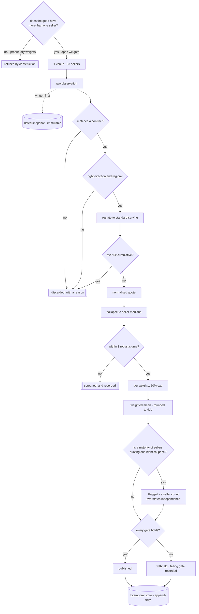
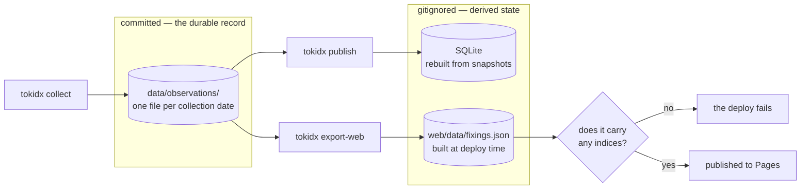

# Token Price Index

A reference implementation of a price benchmark for LLM inference, built around
a settlement benchmark's constraints rather than a pricing comparison
page's.

It exists to answer one question honestly: **which parts of the token market
can carry an index at all, and which cannot.**

## Scope, stated up front

It sits beside [gpu-price-index](https://github.com/henryzhangpku/gpu-price-index),
which asks the same question of compute rental.

**What is here.** Live daily collection from a public source that publishes, per
model, what each independent seller charges to serve the identical weights --
102 observations across 37 sellers on the first run. Collection and estimation
are separate processes: `tokidx collect` reaches the network once and writes a
dated snapshot, and everything downstream reads that file and reaches nowhere,
so a published value can always be shown to follow from its own inputs. A
bitemporal store, where corrections append and must carry a reason. Robust
estimation with a ratio fallback where the usual screen is undefined.
Publication gates that withhold rather than guess. Quality checks for
staleness, seller dropout and level shifts. A property suite over generated
markets rather than chosen ones.

**What is not, and it is the important one.** Every observation arrives through
**one venue**. Twenty-seven sellers of the same weights is twenty-seven sellers
and *one source*. If that source changed its schema, mis-parsed a field, or
went away, the seller count would not notice -- it would keep reporting
twenty-seven right up until it reported none. The compute benchmark found
exactly this shape in its own inputs, where twelve providers turned out to be
five venues with one aggregator behind eight of them, and both count gates
still passed when that feed was removed.

So collected observations sit at the aggregated tier rather than the list tier,
and the venue count is printed next to the seller count. A single-venue index
is not disqualified by that. It is disqualified by not saying so.

**And nothing is calibrated yet.** The compute benchmark sets its
contributor-shift threshold at 25% from 403 observed daily moves with p99 at
21.2%. The equivalent number here is judgement, and the checks that would use
it report `not_evaluable` rather than passing quietly, because a control that
reports success on no evidence is worse than no control. The tape is days old,
not months; nothing here has seen enough daily moves to fit a threshold to.

```
daily fixing
+-----------------------------------------------------------------------------+
|index            |  value | prov | obs |  disp | status    | why             |
|-----------------+--------+------+-----+-------+-----------+-----------------|
|TIX-GLM53-OUT    |  0.498 |   27 |  27 | 0.340 | published |                 |
|TIX-GLM53-IN     |  0.149 |   27 |  27 | 0.360 | published |                 |
|TIX-K3-OUT       | 14.336 |   17 |  20 | 0.170 | published |                 |
|TIX-DSV41-OUT    |  1.191 |   11 |  11 | 0.033 | published |                 |
|TIX-MM3-OUT      |     -- |   13 |  13 | 1.000 | withheld  | dispersion      |
|TIX-FRONTIER-OUT |     -- |    2 |   5 |    -- | withheld  | indexable good, |
|                 |        |      |     |       |           | min providers,  |
|                 |        |      |     |       |           | dispersion      |
+-----------------------------------------------------------------------------+
  USD per million tokens. 2 of 6 indices decline to print,
  and 1 of those cannot print by construction rather than for want of data.
```

## The finding

**A frontier model index is not a benchmark. It is one seller's list price
wearing an index's name.**

Only Anthropic sells Opus 5. Only OpenAI sells GPT-6 Astra. There is no second
price for the same good, so there is nothing to discover, no dispersion to
measure, and no meaningful sense in which an average of them is a market rate.
Publishing one would lend a private pricing decision the authority of a
benchmark.

**Open-weight models are the opposite.** The same weights are served by many
independent sellers competing on price, and the spread is real:

| Kimi K3, output | price per Mtok |
|---|---|
| DeepInfra | $14.25 |
| Together | $15.00 |
| Fireworks | $16.50 |

Identical weights, three sellers, a 16% spread — and across all seventeen
sellers that survive the screen the spread is 1.3×. That is a market, and an
index over it measures something.

So `TIX-FRONTIER-OUT` is included **specifically to be refused.** The gate that
stops it is `indexable_good`, and it fails before any question of data
sufficiency arises.

## Quickstart

```bash
uv run tokidx publish                     # the board
uv run tokidx explain TIX-K3-OUT          # one fixing, end to end
uv run tokidx explain TIX-FRONTIER-OUT    # why a good can be unindexable
uv run tokidx contracts                   # goods, tiers, factors, gates
uv run tokidx calibrate                   # test the factors against sellers
```

`explain` is the one to look at. It walks a fixing in four stages — whether the
good is indexable, what was restated or discarded, which sellers survived the
screen and what weight they carry, and which gates held.

## How it is built

Every arrow that leaves the main line is a place an input is thrown away. Most
of the work in a benchmark is deciding what does not count -- and the first
decision here is made before any price is read.



The concentration branch is not decoration. On the first live collection, 17 of
27 sellers of the same weights quoted an identical $0.50, which is why
dispersion is measured at the ninetieth percentile of deviation rather than the
median: with a majority at one number, MAD is zero on a market spanning six
times. See METHODOLOGY section 5.




**One good per index, and input is never mixed with output.** They are priced
differently by every seller and consumed in different ratios by different
workloads; blending them requires an assumed ratio nobody can observe.

**Rank inputs by what they prove.** A published API rate card is transactable
today by anyone with a card, so unlike a compute-rental benchmark the top
evidence tier is genuinely populated. A price seen through a router carries
less weight, because the router's margin is not visible.

**Collapse each seller to one median.** A provider serving forty models gets
one vote, not forty.

**Screen on median absolute deviation**, which has a 50% breakdown point,
rather than standard deviation, which has none — the outlier being screened for
inflates the very yardstick measuring it. With no spread at all, MAD is zero
and the sigma test is undefined, so the screen falls back to a symmetric ratio
band against the consensus.

**Gate publication** on whether the good is indexable, the seller count, the
observation count, and dispersion. Every gate must hold.

**And withholding is a first-class outcome.** Two of six indices decline to
print. A gap in a series is a fact about the market; an interpolated value is a
fiction about it.

## Commands

```bash
uv run tokidx collect                     # read every seller once, write a dated snapshot
uv run tokidx publish                     # the board: what printed, what refused, why
uv run tokidx explain TIX-GLM53-OUT       # one fixing, from published prices to the decision
uv run tokidx contracts                   # the goods, the weights, the gates
uv run tokidx calibrate                   # test the serving factors against what sellers charge
uv run tokidx sensitivity                 # how much of each fixing the factors are responsible for
uv run tokidx export-web --out web/data   # the JSON the static site reads
```

## Demo site

<https://henryzhangpku.github.io/token-price-index/>

The dashboard renders what the pipeline decided and recomputes nothing, so the
page and the CLI cannot disagree about a published number. The bundle is not
committed: it is generated at deploy time from the observations by `tokidx
export-web`, so there is no second copy to fall out of date. The deploy fails
rather than publishing an empty board.

Asset URLs are stamped with a content hash and CI checks the stamps, because a
stale version string keeps an old script live while the repository holds the
new one — a bug with no explanation anywhere in the source.

## The durable record

One thing is committed, and it is the whole audit trail.

`data/observations/YYYY-MM-DD.json` — exactly what each seller published, as
read, one file per collection date. Collection and estimation are separate
processes for this reason: a pipeline that fetches and computes in one pass can
never show that a past value follows from its own inputs, because those inputs
are gone by the time anyone asks.

Everything else is derived from those files and deliberately not committed.
`web/data/fixings.json` — what was published, and the gates behind it — is
rebuilt at deploy time, because a committed copy is only ever a second version
of the truth waiting to fall out of date.

The SQLite store is derived and gitignored too. It is bitemporal and append-only: a
correction writes a new revision, stamps the old one, and must carry a reason.
`as_of(index_date, knowledge_time)` answers what the tape said for a date *as
known at a moment*, which is the only question a settlement dispute can use.

## Sources

| source | what it gives | tier |
|---|---|---|
| [OpenRouter model endpoints](https://openrouter.ai/api/v1/models) | per-seller pricing for one model, no auth | 2 · aggregated |

**One venue.** Thirty-seven sellers behind a single source is thirty-seven
sellers and one point of failure — if it changed schema or went away, the seller
count would keep reporting thirty-seven right up until it reported none. That is
why collected observations sit at the aggregated tier rather than the list tier,
and why the venue count is printed next to the seller count.

## Layout

```
src/tokidx/
  spec.py         contracts, tiers, factors, gates        <- the methodology
  models.py       record types; raw observation -> quote -> fixing
  collect.py      the live source, and the venue caveat
  sources.py      dated snapshots on disk; collection is not estimation
  normalize.py    restate onto the contract, or reject with a reason
  estimator.py    seller medians -> screen -> weights -> value, or refuse
  quality.py      staleness, dropout, level shifts; not_evaluable is an answer
  store.py        bitemporal, append-only; the as-of query and its index
  pipeline.py     collect, restate, estimate, gate -- one path
  web.py          the bundle the site reads
  cli.py          what a benchmark administrator actually does
```

## What came out of building it

The long form, with the numbers and the workings, is
[docs/FINDINGS.md](docs/FINDINGS.md).


**The dispersion gate read perfect agreement on a market spanning six times.**
Seventeen of twenty-seven sellers of the same weights quote an identical $0.50, so
the median *is* that price, more than half the deviations from it are exactly
zero, and MAD is zero. Qn fails identically — with a majority at one number,
over a quarter of all pairwise differences are zero. Any statistic asking what a
typical deviation from the middle looks like answers zero when the middle is
most of the mass. Dispersion is now the ninetieth percentile of deviation, and
the change has teeth: MiniMax M3 was publishing at 0.000 across a 3.1× market
and now withholds at 0.920.

**The same defect does not exist in the compute benchmark, and the reason is
market structure rather than code.** No two GPU providers quote an identical
price — modal share is 1 of 15, 1 of 9, 1 of 6 — because rental prices are set
independently from hardware, power and utilisation. Token prices are *copied*:
sellers hosting someone else's open weights adopt the publisher's reference
rate. The right scale estimator depends on how a market forms prices, and the
two repositories use different ones for that reason.

**Counting sellers overstates independence twice over.** Once through venues —
thirty-seven sellers, one source. Once through prices — a majority quoting one
number are not independent opinions. Both are measured and printed rather than
left for a reader to work out.

**The context factor was restating a window as a premium, and every published
value was a third too low.** `context_tokens` is the window a seller's one
flat rate covers — 82 of 110 observations say 1,048,576 — not a long-context
tier priced above a base rate. The factor multiplied every quote by 0.80 or
0.65 anyway. Sellers charge $0.50 for GLM 5.3; the site printed $0.325. It
also spread apart sellers quoting the same price at different window sizes,
manufacturing dispersion: DeepSeek V4.1 read 0.184 and reads 0.033 now. Found
the day the sensitivity measure was ported from the compute benchmark, which
reported 0 of 27 quotes conforming and 100% of every fixing resting on that one
factor. Context is a fitness test now — a window short of the contract is a
different good — and nothing is restated. See FINDINGS #7.

**A ceiling nothing could reach is not a control.** The cumulative adjustment cap
was 10.5×, which no combination of factors could touch: serving is a single enum
and the context factor that then existed only reduced. A test caught it. It is
5.0× now, which binds on the cache factor.

**A fixing belongs to its inputs, not to the clock.** The index date came from
`date.today()`, so re-running an unchanged observation set on a later day
produced a later fixing. CI caught it when the committed bundle stopped matching
a fresh one. That is the carry-forward behaviour the gates exist to prevent,
arriving through the back door. The bundle is no longer committed, so that
particular tripwire is gone; `tests/test_determinism.py` now asserts the
property directly, which fails faster and locally.

**A published number needs a stated precision.** Two orderings of the same market
produced values differing in the last bit, because floating-point addition is
not associative and nothing rounded. Found by a property test. Contributions are
summed in a fixed order and rounded once, at four decimal places.

## Tests

```bash
uv run pytest -q
uvx ruff check src tests
```

`tests/test_properties.py` generates markets rather than choosing them, on a
coarse price grid so that exact ties — the case that breaks a median-based
screen — actually occur. Two of the findings above were found by it, on its
first runs.

`tests/test_store.py` asserts a **query plan**: the as-of index ends in
`revision` so the planner can walk backwards and stop at the first row past the
filter, rather than materialising a temporary B-tree to sort. A schema change
that reintroduces the sort fails the suite instead of being discovered under
load.

## What this cannot do

The full list is in [METHODOLOGY.md](METHODOLOGY.md) section 6. The three that
matter most:

**No transaction data.** Every input is a published rate card. Nobody here
observes what anyone actually paid, and enterprise pricing — where the volume
is — is negotiated and invisible. This measures the retail tail.

**No quality adjustment.** Price per token falls while model capability rises,
and this index treats a token as a token. That is the hedonic problem official
statisticians handle for computer prices, and it is not handled here. A falling
series may be describing better models rather than cheaper ones.

**A short tape.** `tokidx collect` is live and the daily workflow appends one
dated snapshot a day, and the site plots the series — each date priced from
its own snapshot, the line broken on any withheld day rather than bridged. But
the series is days long. Every time-dependent control — staleness, seller
dropout, level shifts — reports `not_evaluable` until there is enough history
to judge against, rather than passing on no evidence.

---

A study of which parts of the inference market can support a reference price.
It is a demonstration, not a benchmark. Do not settle anything against these
values.
